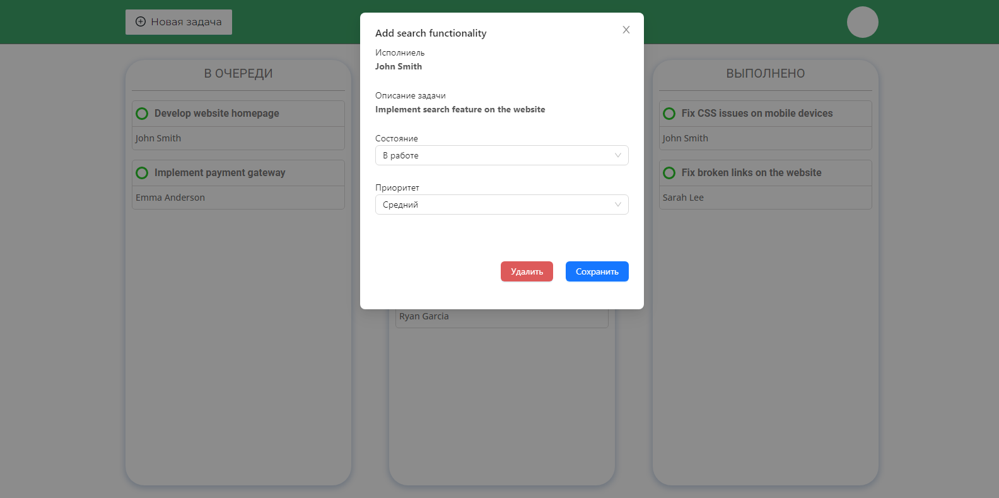

# Планировщик на ReactJS

### Описание

Тестовое задание: необходимо было создать упрощенную версию планировщика задач с помощью React.js. Тестовое
задание состоит из нескольких обязательных задач и нескольких дополнительных. Адаптив обязателен. Основной функционал реализован в полном объеме. Решение дополнительных заданий описано ниже.

---

### Инструменты:


### Установка

> !!! Важно. Для локальной установки и запуска проекта переключитесь на **14** версию NodeJs.

**1. Клонировать репозитрий:**

```command
git clone https://github.com/HL-Dz/scheduler-4dev.git
```

**2. Перейти в папку проекта:**

```command
cd scheduler-4dev
```

**3. Установить зависимости:**

```command
npm install
```

**4. Запустить проект:**

```command
npm run dev
```

### Описание страниц и функционала

**1** Форма авторизации:

- токен хранится на сервере и при правильном вводе логина и пароля происходит редирект на страницу с задачами, токен сохраняется в localStorage
- если данные невалидны, то происходит редирект на страницу /error
  

**2** Страница с задачами


**3** Добавлени новой задачи


**4**Редактирование задачи



**5** Страница ошибки


**6** Адаптив (от 320px)


---

Дополнительные задания:

1. Для фильтрации списков можно использовать метод массива **filter()** и получать только нужные таски. А для сортировки метод массива **sort().**
2. Добавлен build проекта
3. Для проверки совместимости с IE можно использовать сайт canIUse.
